# Notya Dahiliye — İlk Canlı Oturum Rehberi (beta hekim için)

**Kime:** Notya'yı muayenehanesinde ilk kez kullanacak iç hastalıkları uzmanı.
**Ne kadar sürer:** ~45–60 dakika (hasta başına değil, ilk tur için).
**Sürüm:** 2026-09-17 · DAH-WOW Wave 0–4 + DAH-WOW-NEXT (7 kart) canlıda.

> **Görseller hakkında.** Bu rehberdeki ekran görüntüleri **gerçek bir hekim oturumundan değildir**. Hepsi `scripts/dahiliye-smoke.mts` ile, **sentetik QA hastası** ("TEST — Dahiliye Smoke (sentetik)", gerçek kişi değil) ve QA hekim hesabıyla alınmış **örnek ekran — QA verisi**dir. Sizin ekranınızda kendi hastanızın değerleri görünür; düzen aynıdır.

Her maddeyi yaptıkça kutuyu işaretleyin. Beklediğinizden farklı bir şey görürseniz maddenin altına not düşün (bkz. [Bir şey yanlış görünürse](#6-bir-şey-yanlış-görünürse)).

---

## 0. Değişmeyen kurallar (her kartta geçerli)

- **Asistan taslak yazar, hekim kilitler.** Tanı, evre, hedef KB / HbA1c / LDL, risk kategorisi, ilaç kararı ve plan sizin **Kilitle / Hekim onayı** düğmenize kadar *taslaktır*; nota yazılmaz.
- **Bayrak tanı değildir.** Kırmızı/sarı işaretler dikkat çekmek içindir.
- **Doz yazılmaz.** Kartlar yalnız etken madde / sınıf önerir ("hekim dozu yazar"). Bir kartta mg / ünite görürseniz bu bir hatadır — bildirin.
- **Lab değerleri yalnız onayladığınız satırlardan gelir.** Yüklediğiniz PDF'ten çıkarılan satırlar siz **Onayla** diyene kadar şeride ve kartlara girmez.
- **İlaç otomatik kesilmez, sevk otomatik gitmez, hastaya mesaj klinik değer taşımaz.**
- Kaynak dipnotları (TİHUD, TEMD, Türk Hipertansiyon Uzlaşı Raporu 2025, ESC SCORE2 …) yalnız sizin **Kaynak** anahtarınızın arkasındadır; hastaya basılmaz.

---

## 1. Hesap ve branş ayarı

- [ ] **Giriş:** notya-ai.vercel.app › Doktor girişi (e-posta + şifre). Şifreyi Ayarlar › Hesabım'dan kendiniz değiştirin.
- [ ] **Branş:** İlk girişteki tanışma adımında (onboarding) branş olarak **Dahiliye** seçili olmalı. Dahiliye sekmesi branşı *dahiliye / aile hekimliği / genel* olan hekimde ve **erişkin** hastada görünür; çocuk hastada görünmez.
  - Kontrol: herhangi bir erişkin hastanın dosyasını açın — sekmelerde **Dahiliye** var mı? Yoksa branş kaydınız yanlıştır; Kaan'a bildirin (hesap tarafında düzeltilir).
- [ ] **Asistan kişiliği:** Asistan sayfasında varsayılan meslektaş branşınıza göre gelir (Dahiliye · Zeynep Arslan). Farklı biri açılıyorsa bildirin.
- [ ] **Ayarlar › e-Reçete** (isteğe bağlı): TC + SGK hekim şifresi + tesis kodu; "Test et" yalnız salt-okunur kimlik doğrulaması yapar, kayıt açmaz.
- [ ] **İlk hasta:** Gerçek hasta verisini ancak KVKK aydınlatması ve hastanın onayıyla girin. İlk turu isterseniz kendi uydurduğunuz bir test hastasıyla yapın (adını "TEST …" koyun).

---

## 2. İlk hasta — adım adım yol

Bu yol, otomatik smoke testinin (`scripts/dahiliye-smoke.mts`) hekim ekranındaki karşılığıdır.

### 2.1 Özet ve şerit — KB girişi
- [ ] Hasta dosyası › **Dahiliye** › **Özet**: bugünkü ofis KB'sini girin, **Kaydet**.
- [ ] Sayfa üstündeki **BUGÜNKÜ VİZİT** şeridinde KB çipi görünür (hedef dışıysa kırmızı).
- [ ] Şerit KB'yi "kontrolsüz" demeden önce **Bakım kalitesi › KB ölçüm tekniği** listesini ister → işaretleyin, **Tekniği doğrula**.
- Hekim kilidi: yok (ölçüm kaydı). Nota yalnız **Nota ekle** ile gider.

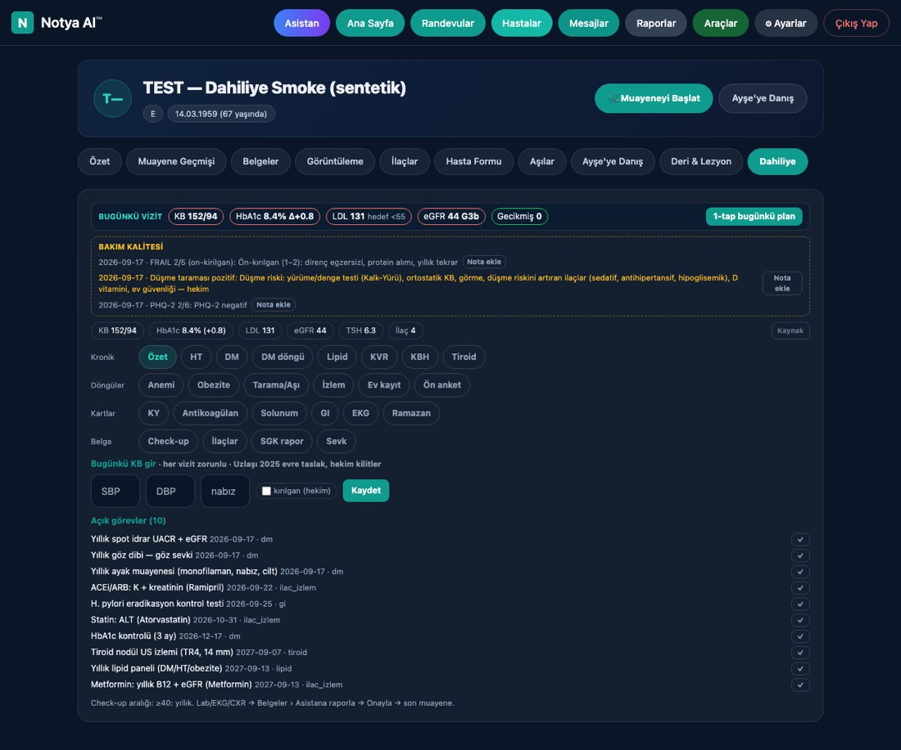

### 2.2 Lab yükleme → onay
- [ ] Hasta dosyası › **Belgeler** › lab PDF'i yükleyin › **Asistana raporla**.
- [ ] Çıkarılan tabloyu kontrol edin (değer, birim, tarih). Yanlış satırı düzeltin.
- [ ] Hekim tanısını yazın › **Onayla**. Tanı yazılmadan Onayla kabul edilmez.
- [ ] **Beklenen:** onaydan önce şeritte HbA1c / LDL / eGFR **yoktur**; onaydan sonra gelir, önceki onaylı panel varsa HbA1c Δ gösterilir.
- Hekim kilidi: **Onayla** (lab satırları ancak bununla "onaylı" olur).

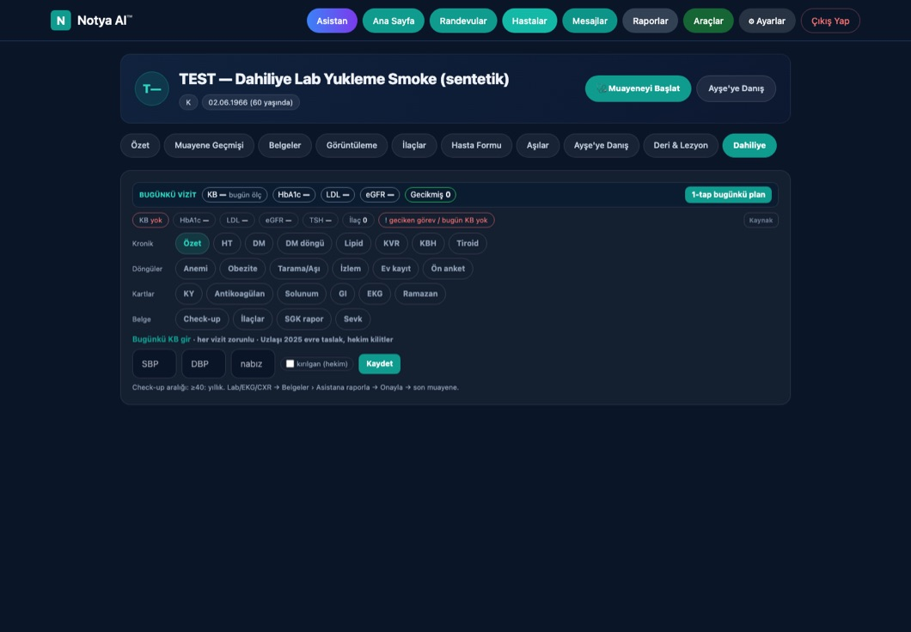
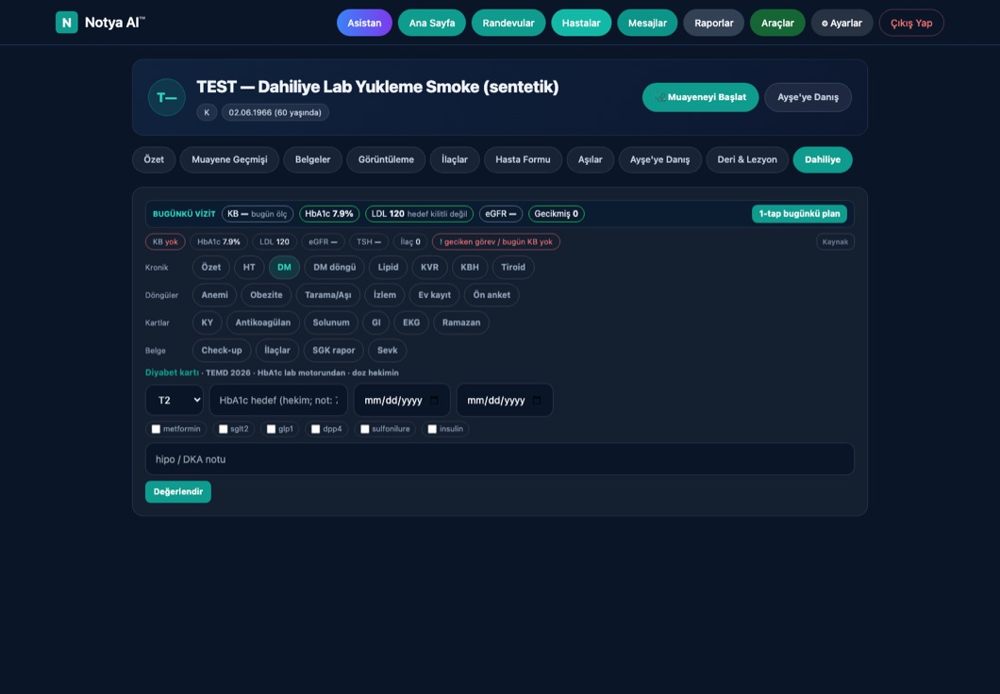

- [ ] **e-Nabız geçmiş PDF'i** (varsa): Dahiliye › Belge › **e-Nabız**. Yalnız sizin yüklediğiniz PDF okunur (canlı e-Nabız çekimi yok); her satır kendi basılı tarihini alır; kimlik eşleşmesi ve **Onayla** kapısı normal lab ile aynıdır.

### 2.3 Kronik kartlar
| Kart | Ne görmelisiniz | Hekim kilidi |
|---|---|---|
| **HT** | Uzlaşı 2025 sınıfı, yaş/kırılganlık kovasına göre hedef, doğrulanmış HT için kombinasyon *sınıf* önerisi | Evre + hedef KB (**KB hedefini kilitle / Kilitle**) |
| **DM** | HbA1c görevi (hedefte değilse 3 ay), yıllık UACR/eGFR, göz dibi sevki, eGFR'ye göre metformin/SGLT2 uyarıları; HbA1c ≥10'da "insülin gereksinimi değerlendir" (titrasyon yok) | HbA1c hedefi |
| **Lipid** | LDL hedefi *öneri*; statin sonrası ALT trendi; TG ≥500 uyarısı | LDL hedefi |
| **KVR (SCORE2)** | 40–69 yaş diyabetsiz: SCORE2 %; DM 40–69: SCORE2-Diabetes %; ≥70: SCORE2-OP %; risk kovası **taslak** | Risk kategorisi + LDL hedefi (**Kilitle**) — kilitlemeden nota yazılmaz |
| **KBH** | KDIGO G×A (yalnız onaylı kreatinin/UACR), hızlı düşüş, RAS/SGLT2 sınıfı, nefroloji sevk paketi | Evre (**Kilitle**) |
| **Tiroid** | TSH eşikleri, doz değişikliği sonrası 6–8 hafta görevi, nodül tarifi (TI-RADS tarzı) | Tanı / tarif kilidi |

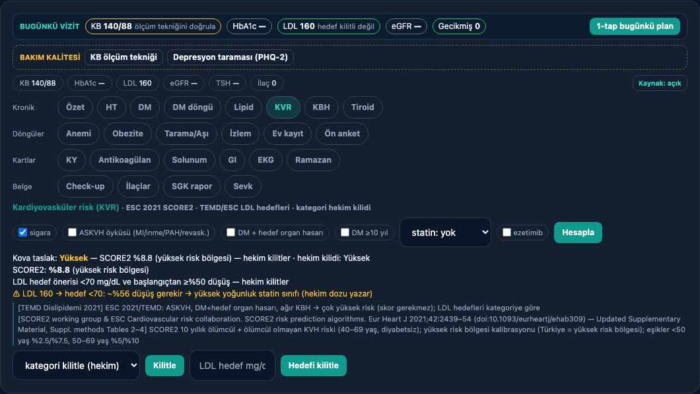
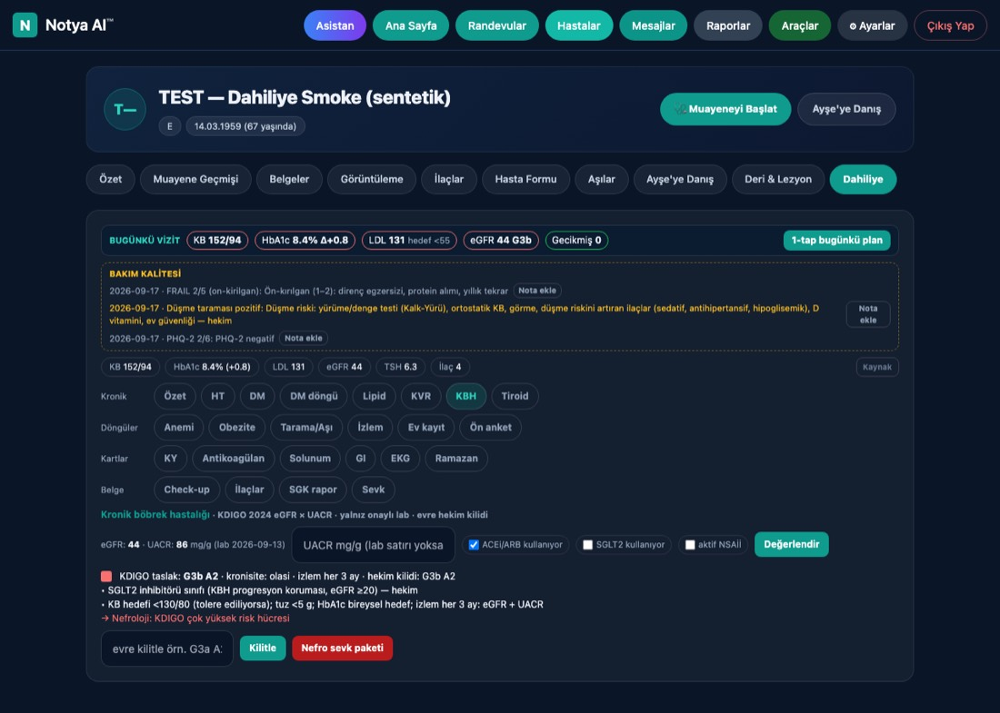

- [ ] Her kartta **Değerlendir** → taslağı okuyun → katılıyorsanız **Kilitle**, katılmıyorsanız değeri değiştirip öyle kilitleyin.
- [ ] Kilitlemediğiniz bir kategori/evre notta **görünmemeli**. Görünüyorsa hata — bildirin.

### 2.4 Döngüler
| Kart | Ne görmelisiniz | Hekim kilidi |
|---|---|---|
| **Ev kayıt** | Ev KB / glukoz / kilo; beyaz önlük / maskeli fenotip; hipoglisemi sayacı. Hasta Sağlığım portalından ön ankette girebilir | Yok (kayıt); yorum nota **Nota ekle** ile |
| **İzlem (ilaç izlem)** | Hastanın ilaç listesinden izlem görevleri: metformin → B12/eGFR, ACEi/ARB → K/Kre, statin → ALT, levotiroksin → TSH, warfarin → INR | Görevleri siz kapatırsınız |
| **Ön anket** | Portaldan gelen ev ölçümleri, uyum, semptomlar; alarm semptomu şeritte ⚑ | **Subjektif'e ekle** sizin elinizde |
| **Anemi / Obezite / Tarama-Aşı** | Test merdiveni, TEMD basamağı, KETEM + erişkin aşı takvimi | Plan kilidi; görevler tek tıkla |

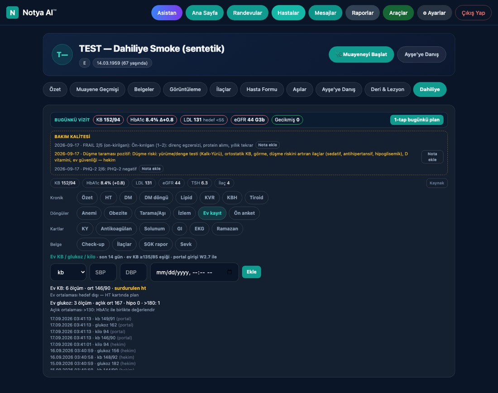
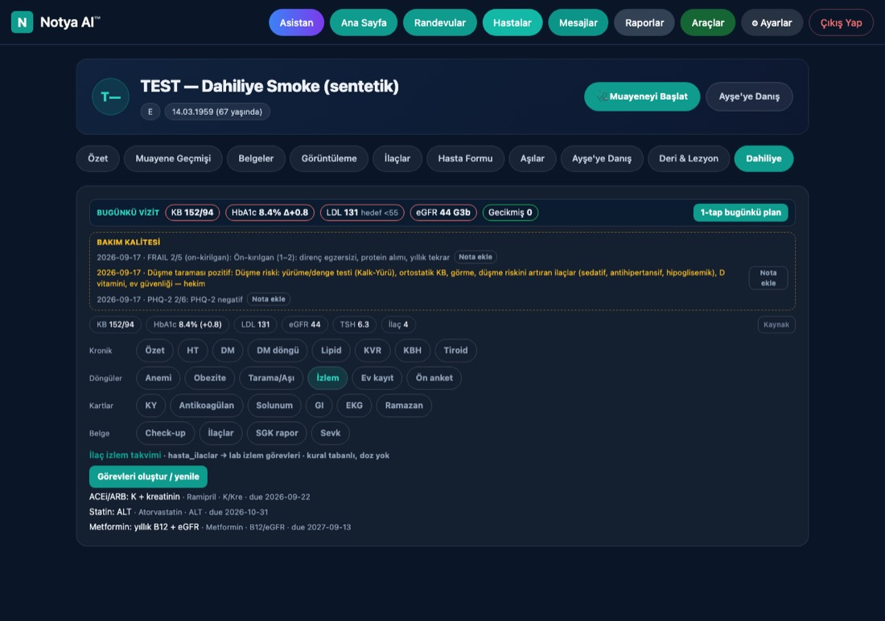

### 2.5 Check-up
- [ ] Dahiliye › Belge › **Check-up** › yaş/cinsiyete uygun paketi başlatın (**Paketi kaydet**).
- [ ] Kalemler onaylı lab ve belgelerle kendiliğinden "tamam" olur; eksikler listede kalır.
- [ ] **Birleşik rapor** → **TASLAK** damgalıdır → **Hekim onayı (kilitle)** → Yazdır / PDF.

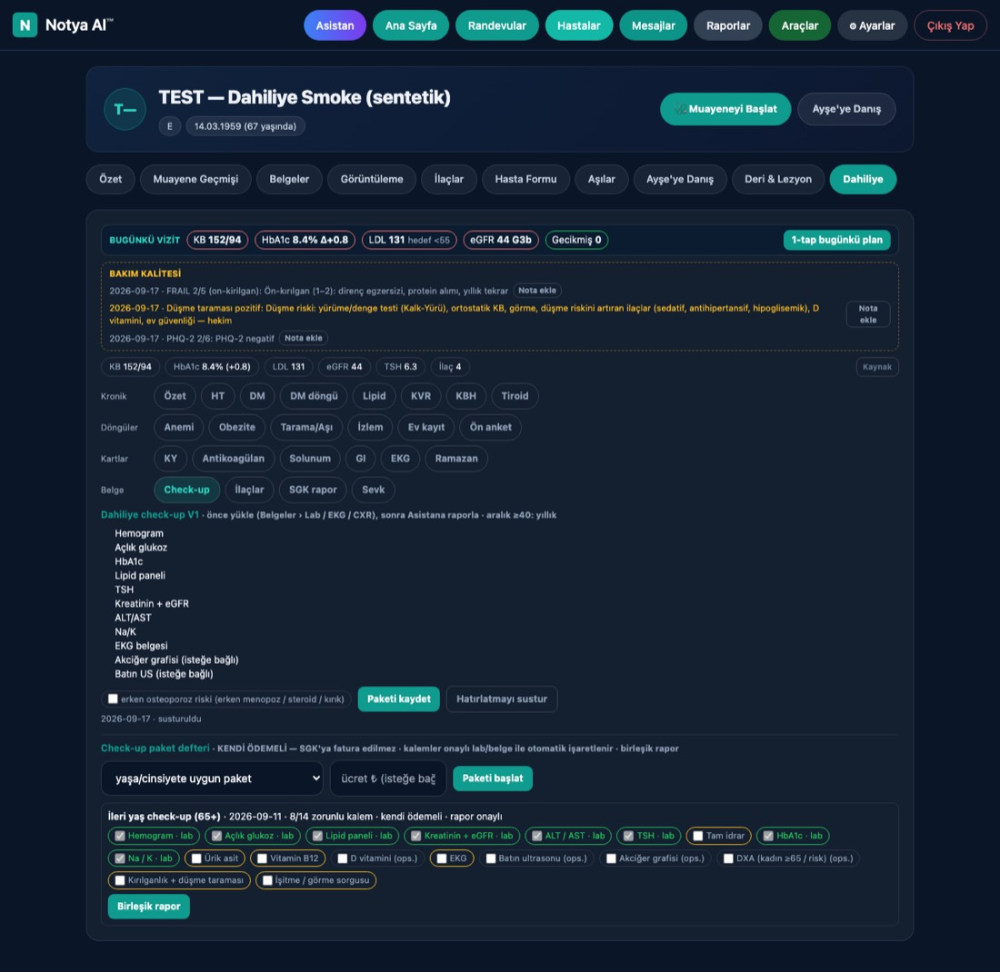
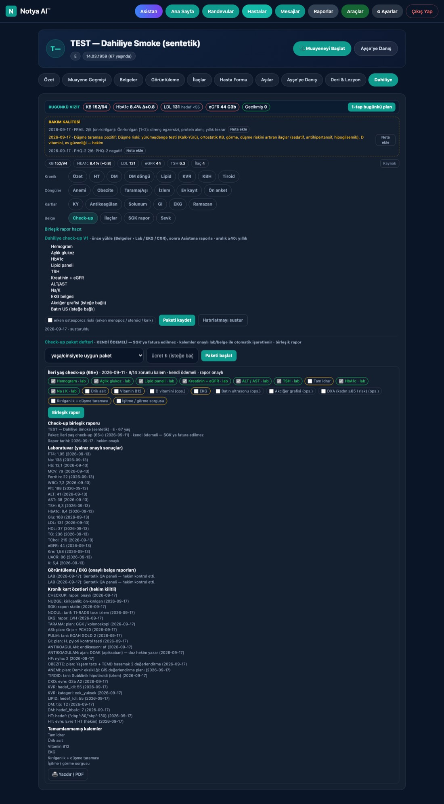

### 2.6 Bugünkü plan → not
- [ ] Şerit › **1-tap bugünkü plan**: kilitli kartlardan ve gecikmiş görevlerden plan taslağı çıkar; nota **kendiliğinden yazmaz**, kopyalayıp SOAP P'ye yapıştırırsınız.
- [ ] Muayene notunu okuyun ve onaylayın. Notta sizin söylemediğiniz bir doz, kılavuz numarası veya tanı varsa bildirin.

### 2.7 Kohort paneli
- [ ] Araçlar › **Dahiliye Kohort Paneli**: bayraklar HbA1c >9 · KB hedef dışı (teknik doğrulanmışsa) · LDL > kilitli hedef · eGFR <45 · gecikmiş lab/aşı/tarama/ilaç izlem · vizit >6 ay.
- [ ] Hasta seçip **hatırlatma** gönderin: mesaj Sağlığım'a gider, **klinik değer içermez**, aynı hastaya 7 günde bir.

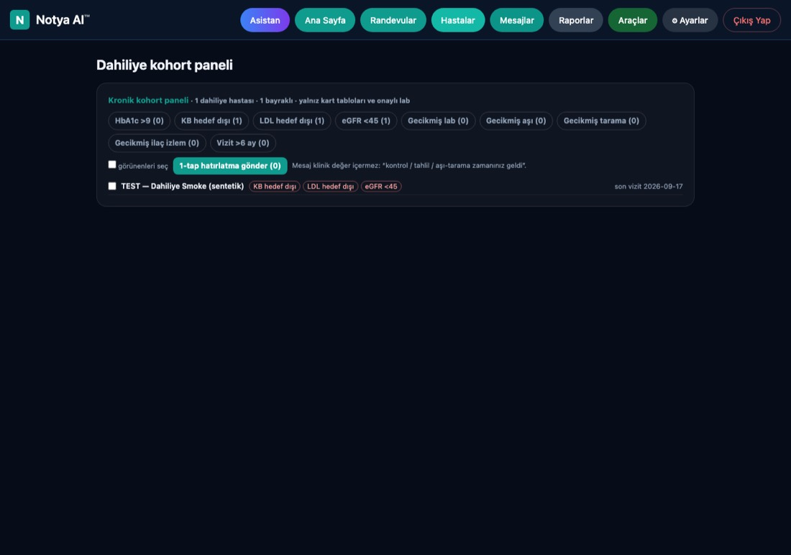

---

## 3. Bakım+ — yeni 7 kart (DAH-WOW-NEXT)

Dahiliye › **Bakım+** satırı (e-Nabız kartı Belge satırındadır).

| # | Kart | Beklenen | Hekim kilidi / kapı |
|---|---|---|---|
| 1 | **Polifarmasi** (≥65) | STOPP/START v3 esinli sınıf uyarıları (ör. NSAİİ + eGFR düşük, NSAİİ + warfarin, tiyazid + hiponatremi). Öneride **doz yok** | Her öneri için **Kabul (plana al)** veya **Uygulama (override)** — engelleyici öneride override gerekçesi ≥15 karakter. **İlaç asla otomatik kesilmez.** Nota yalnız **Kararları nota ekle** |
| 2 | **Hedef kartı** | Yalnız *kilitli* HT / DM / LDL / KVR hedefleri; kilitsiz hedef "Hekiminiz belirleyecek" yazar. 4 Türkçe eğitim yaprağı (doz yok) | **Onayla ve yazdır** (Kaynak dipnotu hastaya basılmaz) |
| 3 | **Sigara** | Paket-yıl, HSI, değişim evresi, 5A, ALO 171, farmakoterapi *sınıfı*, izlem görevleri | **Planı kilitle** → nota |
| 4 | **Vit D / B12** | Onaylı lab → eksiklik sınıfı, sonraki test, replasman sınıfı; SGK `vitd` / `b12` rapor şablonu önerisi | SGK taslağı hekim onayıyla |
| 5 | **e-Nabız geçmiş PDF** | Yüklenen PDF'ten satır başına basılı tarih; trend verisi | Kimlik eşleşmesi + **Onayla** |
| 6 | **Gut / ürik asit** | Atak sınıfları ile ULT merdiveni ayrı, hedef ürik asit, diyet; septik artrit kırmızı bayrağı; warfarin varsa NSAİİ atak sınıfından çıkar | **Tanıyı kilitle**; sevk sizin düğmenizle |
| 7 | **Osteoporoz** | DXA T-skoru *onaylı DXA belgesinden* (**Belgeden al**) veya elle; sınıf, risk bayrakları, DXA aralığı, eGFR'ye göre bisfosfonat uyarısı. **FRAX hesaplanmaz** | **Belgeden al** demeden T-skoru kaydedilmez; **Tanıyı kilitle** |

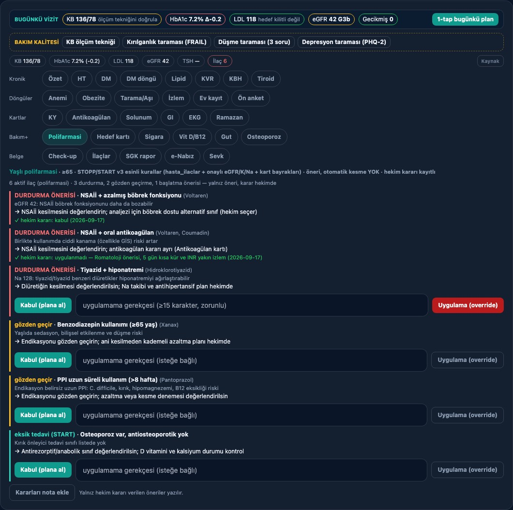
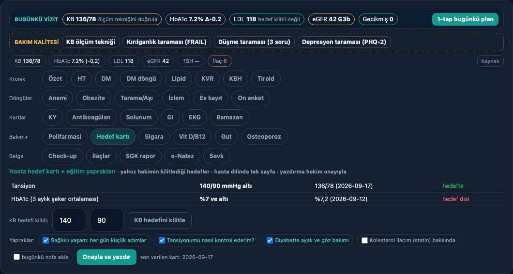
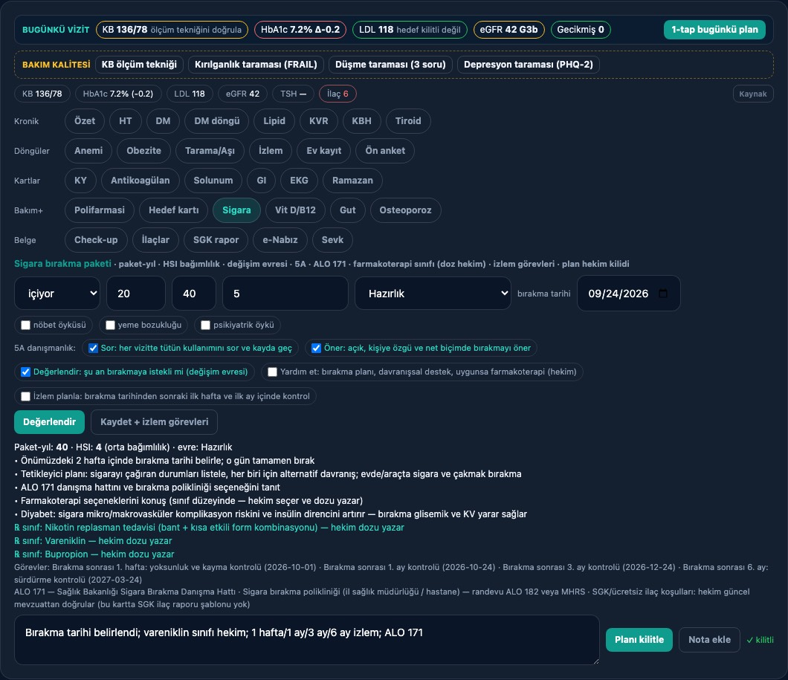
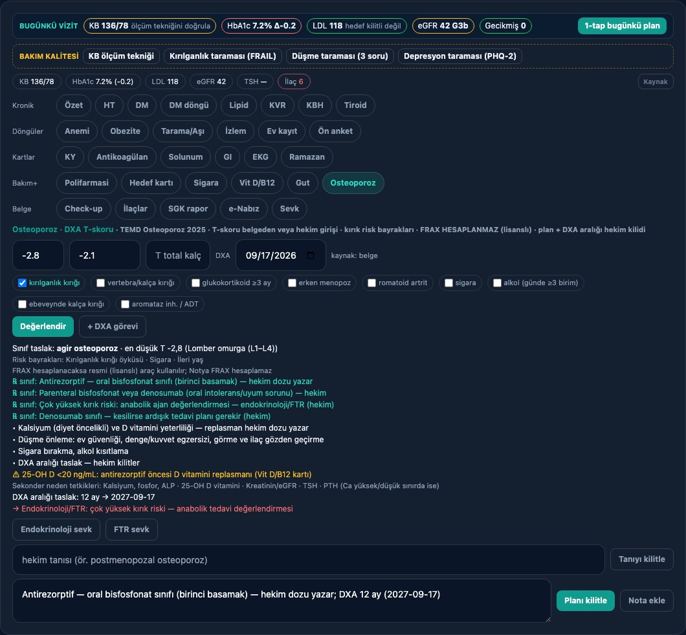

Vit D/B12, e-Nabız ve gut kartları için henüz örnek ekran görüntüsü yok; yukarıdaki tarif geçerlidir.

---

## 4. Belge kartları (kısa)
- **İlaçlar:** hastanın sürekli ilaç listesi (tek liste, kopya yok); eGFR <30 uyarıları yalnız metin, engellemez; ≥5 ilaç → polifarmasi işareti.
- **SGK rapor:** HT / DM / statin / DOAK ilaç kullanım raporu taslağı; eksik kanıt + SUT kontrol listesi; **Hekim onayı** → kilitli → Yazdır / e-Nabız-Medula zarfı. SUT metnini güncel haliyle siz doğrularsınız.
- **Sevk:** kardiyoloji · endokrinoloji · nefroloji · gastroenteroloji · göğüs · göz · üroloji; son onaylı panel eklenir; **Sevk et** sizin düğmeniz.
- **Kırmızı bayrak kapısı:** göğüs ağrısı + yeni EKG, K >6,0, Hb <7, eGFR'de >%30 düşüş, ateş + lökositoz → banner; **acil / sevk** kutusu işaretlenmeden devam edilmez.

---

## 5. Oturum sonu kontrol listesi
- [ ] Kilitlemediğim hiçbir evre / hedef / kategori notta yok.
- [ ] Notta ve kartlarda benim söylemediğim **doz** yok.
- [ ] Notta **uydurma kılavuz numarası / yılı** yok (ör. "ACOG PB 123", "TEMD 2019" gibi benim doğrulamadığım bir atıf).
- [ ] Onaylamadığım lab satırı şeritte veya kartta görünmedi.
- [ ] Hastaya giden yazdırma / portal mesajında Kaynak dipnotu veya klinik değer (hatırlatmada) yok.
- [ ] Telefondan da açıp (Safari / Chrome) aynı ekranın taşmadan göründüğünü kontrol ettim.

---

## 6. Bir şey yanlış görünürse

1. **Hastaya etkisi olabilecekse önce durun:** notu onaylamayın, yazdırmayın, kilitlemeyin. Klinik karar her zaman sizde; Notya'nın taslağına göre işlem yapmayın.
2. **Not alın:** hangi hasta dosyası sekmesi / kart, hangi düğme, ne beklediniz, ne gördünüz, saat. Ekran görüntüsü alacaksanız **hasta adı, T.C., telefon görünmesin** (kırpın veya test hastasında tekrarlayın).
3. **Bildirin:** Beta döneminde uygulama içi geri bildirim kanalı **yok** (karar: beta sonrası değerlendirilecek). Yol, Dr. Gökhan Mamur'un beta test listelerindeki ile aynıdır: notlarınızı **Kaan'a (beta sorumlusu) WhatsApp veya e-posta ile** gönderin. Mesaja hasta kimliği koymayın; "TEST hastası, Dahiliye › KVR, Kilitle sonrası notta kategori çıkmadı" gibi yazmanız yeterli.
4. **Acil klinik durum** Notya'nın konusu değildir: hastayı olağan pratiğinizle yönetin, sonra bildirin.

> **Karar (2026-09-17):** beta için WhatsApp / e-posta yeterli; in-app "Sorun bildir" post-beta'ya ertelendi — `docs/OPEN-COMMITMENTS.md` › BETA-GERI-BILDIRIM-KANALI.

---

## Bağlantılar
- Teknik referans: [README_DAHILIYE.md](./README_DAHILIYE.md)
- Otomatik smoke yolu (geliştirici): `scripts/dahiliye-smoke.mts` → `smoke-out/dahiliye-smoke.json`
- Tüm beta belgeleri: [docs/beta/README.md](./beta/README.md) (Dr. Gökhan Mamur beta test listeleri dahil)
